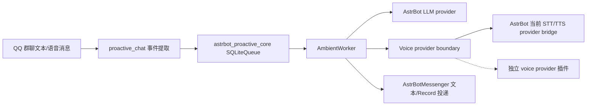

# v0.2 Voice Provider Boundary 路线图

v0.2 的核心方向是固定 voice provider boundary，而不是继续把所有语音能力塞进 proactive chat 主插件。

当前 v0.2 最小功能 slice 已覆盖主插件内的 provider status 诊断：主插件、AstrBot 当前 provider bridge、未来 provider 插件、状态诊断和测试门禁都有明确边界。独立 provider 模板仓库和真实本地 HTTP provider 插件仍是后续工作。

## 架构原则

`astrbot_plugin_proactive_chat` 只负责：

- AstrBot 插件入口、配置读取和管理命令。
- QQ 群聊事件提取，包括文本和语音消息。
- 主动消息策略、限流、免打扰和 kill switch。
- 使用 `astrbot_proactive_core` 队列消费任务。
- 调用当前已选择的 LLM/STT/TTS 抽象接口。
- 文本或语音投递，以及 TTS 失败后的文本回退。

voice provider 或 provider 插件只负责：

- STT/TTS 能力本身。
- provider credentials 和 endpoint 配置。
- provider 专属请求格式。
- provider 限流和错误映射。
- provider 专属测试和文档。

voice provider 不拥有 queue、persona、memory、proactive policy、conversation allowlist 或 delivery state。

## v0.2 不做

- 不做长期 memory。
- 不做 WebUI。
- 不把 Telegram 或 Discord 声明为正式支持平台。
- 不做视觉、game、desktop 或 live-event adapter。
- 不重写 `astrbot_proactive_core` 为 daemon。
- 不在主插件中内置 OpenAI、Gemini 或大型本地模型。

## 固定协议

详细协议见 `docs/VOICE_PROVIDER_BOUNDARY.md`。

最小 STT/TTS 协议：

```python
from typing import Literal


class SpeechToTextProvider:
    async def transcribe(self, unified_msg_origin: str, audio_url: str) -> str: ...


class TextToSpeechProvider:
    async def synthesize(self, unified_msg_origin: str, text: str) -> str: ...


VoiceProviderStatus = Literal["available", "missing", "failed", "disabled"]
```

返回值必须是主插件可直接消费的公开结果：

- STT 返回文本。
- TTS 返回可交给 AstrBot `Record` 消息段的音频引用。
- provider 异常必须映射为 public-safe failure code。

## Provider Capability 状态

v0.2 给 `/proactive_status` 增加 voice provider 状态：

```text
voice:
- input: enabled/disabled
- output: enabled/disabled
- stt_provider: available/missing/failed/disabled
- tts_provider: available/missing/failed/disabled
```

状态输出只能使用公开安全字段：

- `available`
- `missing`
- `failed`
- `disabled`

失败时只显示稳定 `failure_code`，例如：

- `stt_provider_unavailable`
- `tts_provider_unavailable`
- `stt_probe_failed`
- `tts_probe_failed`

不允许输出 token、Authorization header、cookie、完整签名 URL、本地敏感路径、base64 或原始音频 payload。

## Provider 插件模板

模板仓库名固定为：

```text
astrbot_plugin_proactive_voice_template
```

模板仓库只包含：

- 最小 `metadata.yaml`
- `_conf_schema.json`
- 本地 fake STT/TTS provider
- README 中文安装说明
- pytest 覆盖 provider 可用、未配置和失败脱敏

模板仓库不包含大型模型、二进制权重、真实密钥或主插件队列逻辑。

## 第一个真实 Provider

第一个真实 provider 方向固定为本地 HTTP provider。

建议仓库名：

```text
astrbot_plugin_proactive_voice_http
```

最小 HTTP 形状：

```text
POST /v1/stt
POST /v1/tts
```

STT 返回：

```json
{"text": "..."}
```

TTS 返回其一：

```json
{"audio_url": "..."}
```

```json
{"audio_path": "..."}
```

本地 HTTP provider 插件负责 endpoint、timeout、voice name 和认证 token 配置。主插件只消费抽象后的 STT/TTS provider，不直接知道 HTTP 细节。

## 数据流



## v0.2 设计验收标准

- 主插件不依赖任何单一语音 provider。
- 没有 STT/TTS provider 时，文本链路仍然可用。
- STT/TTS provider 状态能在 `/proactive_status` 中公开安全地诊断。
- STT 失败不调用 LLM。
- TTS 失败回退文本。
- 文本和语音投递都失败时不计入限流。
- provider 错误不泄露密钥、完整 URL、本地路径或原始 payload。
- 至少一个 provider 插件模板可以被社区复制使用。

## 当前功能验收状态

- 已实现 `VoiceProviderState`、公开 provider probe 结果和 `/proactive_status` voice 区块。
- 已覆盖 STT/TTS `available`、`missing`、`failed`、`disabled` 状态。
- 已覆盖 status 输出脱敏，避免暴露 token、Authorization header、cookie、完整 URL、base64 和本地路径。
- 已保持现有 worker 语义：STT 失败不调用 LLM，TTS 失败回退文本，投递失败不计入限流。
- 未发布新的 PyPI patch；如需对外发版，应走 `0.1.x` 维护策略重新验证。

## 后续实现门禁

实现后续 v0.2 runtime 变更前必须继续保持这些测试：

- `tests/test_voice.py`：STT/TTS available、missing provider、probe failure redaction。
- `tests/test_management.py`：`/proactive_status` 包含 voice input/output 和 STT/TTS provider 状态，并验证脱敏。
- `tests/test_worker.py`：现有语音输入、TTS fallback、delivery failure、rate limit 语义继续通过。

发布前仍必须跑：

```bash
uv run python scripts/smoke_check.py
uv run --extra dev pytest -q
uv run --extra dev ruff check .
uv build
```
